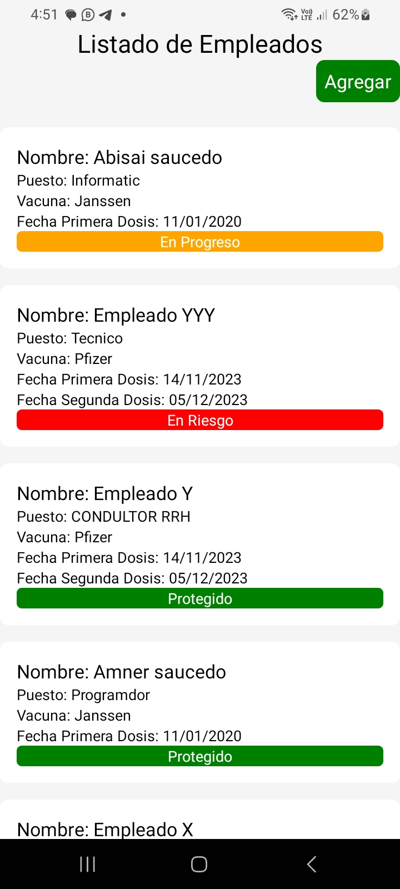
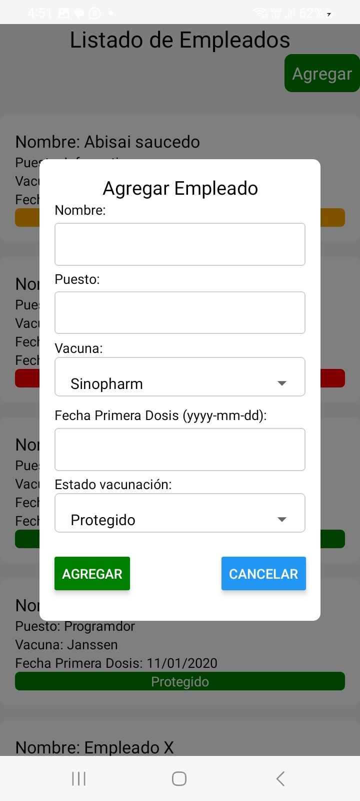
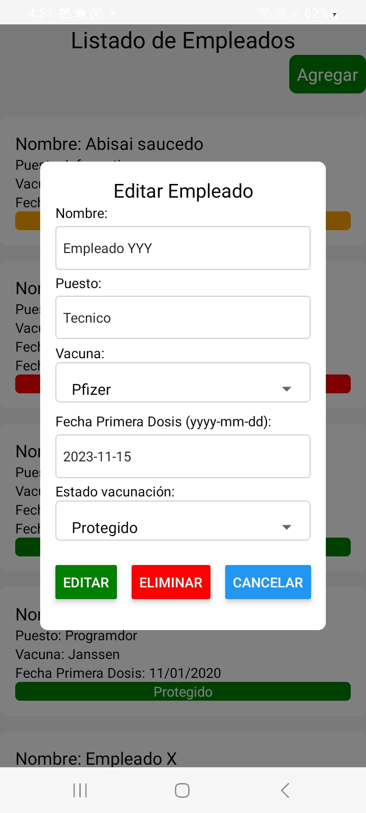

# Prueba de Ingreso de Empleados - Aplicación Fullstack

Este proyecto es una aplicación móvil desarrollada con tecnología React Native y un servidor Node.js en el lado del backend. Su objetivo es gestionar el ingreso de empleados en una base de datos MySQL.

## Requisitos

Asegúrate de tener instalados los siguientes componentes antes de comenzar:

- [Node.js](https://nodejs.org/)
- [React Native](https://reactnative.dev/)
- [MySQL](https://www.mysql.com/)

## Pasos de Instalación

1. **Descarga el código:** Clona este repositorio o descarga el código completo.
2. **Configura la base de datos:**
   - Crea una base de datos llamada `prueba_fullstack` en tu motor de base de datos MySQL.
   - Importa la estructura de la base de datos desde el archivo `base_de_datos/schema.sql` en la raíz del proyecto.
## Ejecutar el Backend
Para iniciar el servidor Node.js (backend):
1. **Navega a la carpeta backend:** Abre una terminal y navega hasta la carpeta `app_backend`.
2. **Instala dependencias:** Ejecuta el siguiente comando para instalar las dependencias:
   `npm install`
3. **Iniciar el Backend:**
   - Para iniciar el servidor Node.js del backend, navega a la carpeta del proyecto (`app_backend`) y asegúrate de tener las dependencias instaladas ejecutando `npm install`.
   - Luego, inicia el servidor con el comando `nodemon index.js`. Asegúrate de tener `nodemon` instalado de forma global.
   - Por defecto, el servidor utiliza el puerto 3000. Si deseas cambiar el puerto, puedes configurarlo en el archivo `.env`.

## Ejecutar la Aplicación Móvil

1. **Preparar el Dispositivo:**
   - Conecta un dispositivo físico (teléfono o tablet) a tu ordenador y asegúrate de que el modo de depuración USB esté habilitado en el dispositivo.

2. **Configurar la Dirección IP:**
   - Abre una terminal o CMD en Windows y ejecuta el comando `ipconfig` para obtener la dirección IP de tu ordenador.
   - Toma nota de la dirección IP y utilízala en la siguiente configuración.

3. **Instalar las Dependencias:**
   - Navega a la carpeta de la aplicación móvil (`app_reactnative`) y ejecuta el comando `npm install` para instalar las dependencias.

4. **Ejecutar el Proyecto:**
   - Utiliza el comando `npm run android` para ejecutar la aplicación en un dispositivo Android.

Si todo se ha configurado correctamente, la aplicación debería mostrar los datos de la tabla por defecto.

¡Listo! Ahora tienes el proyecto instalado y funcionando. Puedes comenzar a ingresar empleados desde la aplicación móvil y gestionarlos en la base de datos.

# CARPETA `POSTMAN`
Se utilizo para hacer las pruebas con el backend desde postman, se adjuntaron todas las funciones de un crud para poder hacer pruebas solo para el lado del backend desde postman.

# como deberia verse la app

